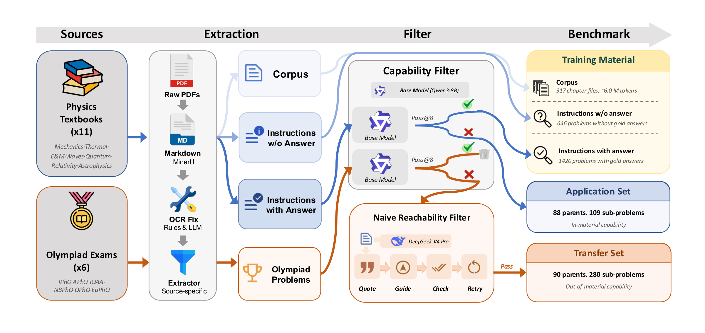

<div align="center">

# StudyBench: Can Self-Evolution Squeeze Textbooks for Olympiad Capability?

[](https://arxiv.org/abs/2609.00787)  [](https://arxiv.org/abs/2609.00787)  [](https://github.com/thunlp/StudyBench)  [](https://huggingface.co/papers/2609.00787)

**A controlled physics benchmark that measures how much capability a self-evolution method can squeeze out of a fixed shelf of textbooks.**

</div>

- ✨ [Paper](https://arxiv.org/abs/2609.00787)
- 💻 [Code](https://github.com/thunlp/StudyBench)



---

## 📖 Introduction

A physics student needs only a handful of well-written textbooks to reach the hardest problems in the field. The capability is already latent in the pages; reading is the act of pressing it out. **StudyBench** asks whether a self-evolution method can perform the same squeeze — turning a fixed corpus of textbooks into transferable problem-solving capability, with no extra human supervision.

The material is eleven canonical physics textbooks. The test side is split so the two things people conflate stay separate:

- **Application Set** — hard end-of-chapter textbook problems, measuring *absorption* of the material.
- **Transfer Set** — olympiad-level theory problems certified reachable from the same books, measuring *transfer* to problems harder than any exercise.

Across three base models (Llama-3.2-3B-Instruct, Qwen3-8B, Opus 4.7), the juice mostly stays in the fruit. On Qwen3-8B, **GEPA** — the strongest method here — lifts Application `Par@8` from **17.05 to 34.85**, yet its Transfer `Par@8` reaches only **7.04**. Supply the very same textbook content as in-context guidance and Transfer `Par@8` jumps to **100.00**: the capability is provably in the books, so the shortfall is not missing material. Pushing harder on compute does not recover it either — scaling one loop from **8 to 614 GPU·hr (76×)** leaves accuracy saturated early, around **~8.5 GPU·hr**. **The remaining gap is a method problem, not a data or compute problem.**

This repository releases the two test sets, the two instruction layers, the evaluation code, and the pipeline that rebuilds the copyrighted **Corpus** from your own legal copies of the textbooks. **StudyBench is accepted to EMNLP 2026 Findings.**

---

## 📊 Benchmark at a Glance

Training material is factored into three nested layers so different self-evolution families can consume what they need:

| Layer                           | What it is                                  | Size                            |
| ------------------------------- | ------------------------------------------- | ------------------------------- |
| **Corpus**                      | Raw textbook passages (Markdown)            | ~6.0M tokens |
| **Instructions with Answer**    | Exercises whose gold answer we extracted    | 1,420                           |
| **Instructions without Answer** | Exercises without a recoverable gold answer | 646                             |

The two test splits form a built-in difficulty progression. Items are filtered with Qwen3-8B, then reused for the other base models.

| Split               | Source                                    | Parents | Sub-problems | What it measures                                       |
| ------------------- | ----------------------------------------- | ------- | ------------ | ------------------------------------------------------ |
| **Application Set** | Hard textbook exercises                   | 88      | 109          | Absorption of the training material                    |
| **Transfer Set**    | APhO / EuPhO / IPhO / IOAA / NBPhO / OPhO | 90      | 280          | Transfer to problems harder than any textbook exercise |

Construction guarantees three properties:

1. **Capability Gap** — retained items lie outside Qwen3-8B's reliable `pass@8` capability.
2. **Reachability** — every Transfer parent is solvable under textbook-grounded guidance; Application items are reachable by construction (the prerequisite lives in the same chapter).
3. **Controlled Attribution** — training material, items, and protocol are fixed across methods, so a score isolates the algorithm.

---

## ⚡ Quick Start

**Prerequisites**

- Python 3.10+
- An OpenAI-compatible API (for generation and/or the LLM judge), **or** a local vLLM server
- Optional: a [MinerU](https://mineru.net/apiManage/docs) token, only if you rebuild the Corpus

**Installation**

```bash
git clone https://github.com/thunlp/StudyBench.git
cd StudyBench
pip install -r requirements.txt
```

Create `env_local.sh` in the repo root (gitignored; do not commit secrets). The benchmark wrappers source it automatically:

```bash
export OPENAI_API_KEY="your-key"
export OPENAI_BASE_URL="https://your-endpoint/v1"
# optional, only for Corpus rebuild
export MINERU_TOKEN="your-mineru-token"
```

**Evaluate a model.** Open-weight models go through `benchmark_model.sh` (vLLM serve + generate + judge). Pick a split with `DATASET=textbook` (Application Set) or `DATASET=competition` (Transfer Set).

```bash
# Qwen3-8B on the Application Set (override the cluster-specific defaults)
MODEL_DIR=/path/to/Qwen3-8B \
SERVED_MODEL_NAME=qwen3_8b \
DATASET=textbook \
OUTPUT_DIR=results_qwen3_8b \
TAG=qwen3_8b_application \
PASS_K=8 TEMPERATURE=1.0 TOP_P=0.95 TOP_K=20 MAX_TOKENS=32768 \
JUDGE_MODEL=deepseek-v4-flash-0731 \
JUDGE_BASE_URL="$OPENAI_BASE_URL" \
bash benchmark_model_qwen3_8b.sh

# Same model on the Transfer Set
DATASET=competition TAG=qwen3_8b_transfer bash benchmark_model_qwen3_8b.sh
```

Paper protocol for open-weight models: `k=8`, temperature `1.0`, top-*p* `0.95`, top-*k* `20`, 32,768-token cap, thinking mode on for Qwen3-8B; repeat three times with independent seeds and report mean ± std. Opus 4.7 uses `k=1` through a separate agent wrapper (`benchmark_claude_code_opus.sh`), not vLLM.

Method-specific conditioning is applied at eval time. Guidance is compatible with the three prompt artefacts; ACE / GEPA / EvoSkill are mutually exclusive:

| Artefact                   | Flag / env                                        |
| -------------------------- | ------------------------------------------------- |
| ACE playbook               | `--ace_playbook_path` / `ACE_PLAYBOOK_PATH`       |
| GEPA system prompt         | `--gepa_prompt_path` / `GEPA_PROMPT_PATH`         |
| EvoSkill skills            | `--evoskill_skills_path` / `EVOSKILL_SKILLS_PATH` |
| Textbook-grounded guidance | `--guidance_path` / `GUIDANCE_PATH`               |

You can also call the runner directly (`python eval/run_benchmark.py …`); relative `--data_paths` resolve from `eval/`, and `RUN_MODE=generate|eval|full` selects generate-only / judge-only / both.

---


## 📚 Training Material

Methods that consume only instruction layers can start from the released files. Methods that need raw passages must rebuild the Corpus locally (next section).

```
train_data/
  verifiable_instr.json            # 867 single-turn items with gold answers
  verifiable_instr_multi_subs.json # 553 multi-turn items (one turn per sub-problem)
  unverifiable_instr.json          # 646 items without a recoverable gold answer
  verifier.py                      # rule-based reward for RL (no LLM judge)
```

`Instructions with Answer` = the two `verifiable_*.json` files (1,420). `Instructions without Answer` = `unverifiable_instr.json` (646). Each record is a chat-style `messages` list plus `answer` / `answer_type` / `type_sequence` / `metadata`.

Nine answer types match the evaluator — `NV` numeric value, `EX` symbolic expression, `EQ` equation, `TUP` ordered tuple, `IN` interval, `MC` single multiple-choice letter, `TF` boolean, `QL` short qualitative phrase, `ALT` alternative acceptable forms. Composite types (`TUP`, `ALT`) carry a `type_sequence` telling the verifier how to judge each slot.

For RL, use only the rule-based verifier so the reward signal cannot be hacked through the LLM judge:

```python
from train_data.verifier import compute_reward_by_answer_type

reward = compute_reward_by_answer_type(
    pred=model_answer,
    gold=gold_answer,
    answer_type="EX",          # or TUP / ALT / ...
    type_sequence="",          # e.g. "EQ,EQ" for TUP
)
```

Extracted textbook instructions and competition problems are released for **academic research only** and must not be used commercially.

---

## 🧪 Evaluation Protocol

`eval/run_benchmark.py` scores one parent at a time, sub-problem by sub-problem, with conversational continuity: at sub-problem *i* the model sees the shared stem, the previous sub-problem statements, and **its own** earlier answers — never the gold solutions. A failed extraction inserts a fixed placeholder and the parent continues, so later subs are still scored.

Two accuracies, matching the paper:

- **Parent accuracy (`Par@k`)** — a parent is correct only if some single attempt solves every sub-problem.
- **Sub-problem accuracy (`Sub@k`)** — each sub-problem is correct if any of the *k* attempts solves it.

The verifier is two-stage: a rule-based judger (UG-Physics plus `QL` and `type_sequence`) and, on remaining failures, an LLM judge (paper: DeepSeek-V4-Flash-0731). Results land under `eval/results/<output_dir>/<tag>/`.

```bash
python scripts/benchmark_stats.py          # dataset inventory
python scripts/pass_at_8_stats.py          # Par@8 / Sub@8 from a 24-attempt dump
```

The **Naive Reachability Filter** that certifies the Transfer Set is reproduced under `filter/`. It decomposes each olympiad sub-problem into knowledge points, retrieves and verifies textbook fragments, then writes methodological guidance naming which concepts and formulae to use — without stating the answer. Pass the resulting guidance JSON to evaluation with `--guidance_path` / `GUIDANCE_PATH`; see `filter/README_filter.md` for stage-by-stage inputs and outputs.

---

## 🔧 Rebuild the Corpus

The eleven textbooks are in-copyright commercial works. We ship no PDFs, scans, or parsed Markdown — only the **processing pipeline**. Collect your own legal copies (and, where relevant, official solution manuals), lay them out as below, and run the pipeline. It converts PDFs to Markdown, applies light OCR cleanup, and redacts every Application Set item so the training Corpus does not contain the test problems.

Use these **directory names** exactly. `redact_eval.py` matches the last folder under `PhysicsBooks/` to the `"source"` field in the eval JSON. Books with a dagger are bundled with their official solution manual — put those PDFs in the same `source` directory.

| Directory (`source`)               | Textbook                                                    | Area             |
| ---------------------------------- | ----------------------------------------------------------- | ---------------- |
| `Morin_ClassicalMechanics`         | *Introduction to Classical Mechanics* (Morin)               | Mechanics        |
| `Kleppner_Mechanics`               | *Introduction to Mechanics* (Kleppner & Kolenkow) †         | Mechanics        |
| `Purcell_EM`                       | *Electricity and Magnetism* (Purcell & Morin) †             | Electromagnetism |
| `Griffiths_Electrodynamics`        | *Introduction to Electrodynamics* (Griffiths) †             | Electromagnetism |
| `Blundell_ThermalPhysics`          | *Concepts in Thermal Physics* (Blundell & Blundell) †       | Thermal Physics  |
| `Georgi_Waves`                     | *The Physics of Waves* (Georgi) †                           | Waves            |
| `EisbergResnick_QuantumPhysics`    | *Quantum Physics* (Eisberg & Resnick)                       | Quantum Physics  |
| `French_SpecialRelativity`         | *Special Relativity* (French)                               | Relativity       |
| `TaylorWheeler_SpacetimePhysics`   | *Spacetime Physics* (Taylor & Wheeler)                      | Relativity       |
| `CarrollOstlie_ModernAstrophysics` | *An Introduction to Modern Astrophysics* (Carroll & Ostlie) | Astrophysics     |
| `Palen_SchaumAstronomy`            | *Schaum's Outline of Astronomy* (Palen)                     | Astrophysics     |

Split each book into one PDF per chapter, then run:

```bash
bash corpus_process.sh
```

Three steps; existing outputs are skipped (`--force` to redo a step):

1. **Parse** — `corpus_scripts/mineru_parse.py` uploads pending PDFs to MinerU (VLM+OCR) and unpacks `full.md`.
2. **OCR cleanup** — `corpus_scripts/ocr_fix.py` writes `ocrfix.md` (drop VLM prompt leaks, rejoin split math, strip leftover page numbers).
3. **Redact** — `corpus_scripts/redact_eval.py` finds the single best passage for each Application Set field and replaces it with `[REDACTED]` (default: 13-gram seeds, 60% coverage). The eval JSON is never modified.

After a successful run, train on `PhysicsBooks/<source>/**/ocrfix.redacted.md` only. Do not commit or redistribute `PhysicsBooks/`, the PDFs, or the parsed Markdown — they remain derived from copyrighted books.

---

## 🧩 Directory Structure

```
StudyBench/
├── train_data/                        # instruction layers + RL verifier
├── eval/
│   ├── run_benchmark.py               # generate + judge
│   ├── eval.py / judge.py             # two-stage verifier
│   └── data/
│       ├── qwen3_8b_textbook_problem.json      # Application Set
│       └── qwen3_8b_competition_problem.json   # Transfer Set
├── corpus_process.sh                  # PDF → Markdown → redact
├── corpus_scripts/
├── filter/                            # reachability / guidance pipeline
├── scripts/                           # dataset stats, pass@8 aggregation
├── benchmark_model.sh                 # vLLM / OpenAI-compatible wrapper
├── benchmark_model_qwen3_8b.sh
├── benchmark_model_llama3_2_3b_instruct.sh
└── benchmark_claude_code_opus.sh      # Claude Code / Opus wrapper
```

---

## 📌 Main Findings (Qwen3-8B)

| Method          | Layer             | App. `Par@8` | App. `Sub@8` | Trans. `Par@8` | Trans. `Sub@8` |
| --------------- | ----------------- | ------------ | ------------ | -------------- | -------------- |
| Qwen3-8B (base) | —                 | 17.05        | 29.36        | 0.00           | 56.43          |
| Bonito          | Corpus            | 21.21        | 28.13        | 4.44           | 35.00          |
| GRPO            | Instr. w/ answer  | 28.41        | 38.84        | 4.07           | 57.02          |
| **GEPA**        | Instr. w/ answer  | **34.85**    | **44.34**    | **7.04**       | **58.57**      |
| ACE             | Instr. w/ answer  | 31.06        | 41.90        | 2.96           | 57.26          |
| TTRL            | Instr. w/o answer | 28.79        | 38.84        | 2.59           | 58.57          |
| Intuitor        | Instr. w/o answer | 26.89        | 38.23        | 5.56           | 58.21          |
| R-Zero          | Data-free         | 29.55        | 39.14        | 4.07           | 58.10          |
| Naive Guidance  | Corpus @ infer.   | —            | —            | 100.00         | 100.00         |

GEPA is the strongest Application-Set method, yet Transfer `Par@8` reaches only 7.04 against a 100.00 guidance ceiling — about **7%** of the parent-level Guidance Gap. Every profiled loop also hits a **Compute Plateau**: extra GPU-time past ~8.5 GPU·hr does not close the rest, even out to 614 GPU·hr.


Full tables, Llama-3.2-3B-Instruct, Opus 4.7 (where most methods do not lift Transfer above the base model), and the per-method plateau curves are in the paper.

---

## 🎈 Citation

If you use StudyBench, please cite:

```bibtex
@misc{chen2026studybenchselfevolutionsqueezetextbooks,
      title={StudyBench: Can Self-Evolution Squeeze Textbooks for Olympiad Capability?}, 
      author={Yinghao Chen and Zixi Chen and Bingxiang He and Ziqing Qiao and Huan-ang Gao and Yinuo Xu and Yuxin Zuo and Zeyuan Liu and Yuhao Zhan and Chaojun Xiao},
      year={2026},
      eprint={2609.00787},
      archivePrefix={arXiv},
      primaryClass={cs.AI},
      url={https://arxiv.org/abs/2609.00787}, 
}
```

---

## 🌻 Acknowledgement

The rule-based verifier builds on [UG-Physics](https://github.com/YangLabHKUST/UGPhysics); Corpus parsing uses [MinerU](https://mineru.net/) for PDF-to-Markdown conversion. Issues and PRs are welcome — evaluation bugs, verifier edge cases, and documentation fixes — but please do not open PRs that add textbook PDFs, parsed Markdown, or other copyrighted material. Thanks for their great contributions!
