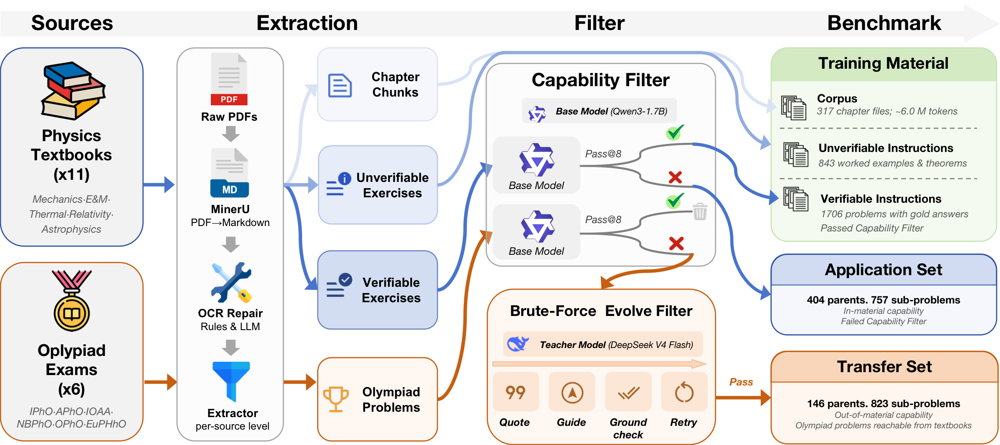

<div align="center">

# StudyBench

### Can Self-Evolution Squeeze Textbooks for Olympiad Capability?

[](https://github.com/thunlp/StudyBench)
[](./paper.tex)
[](https://github.com/thunlp/StudyBench)

*Accepted to **EMNLP 2026 Findings***

<br/>


</div>

---

## 🚀 Introduction

Humans need only a handful of well-written textbooks to master a discipline and attempt its hardest problems. An ideal self-evolution method should share the same property: **autonomously learning from raw training material for transferable problem-solving capability**.

**StudyBench** is a controlled physics benchmark that measures how efficiently a self-evolution method converts a fixed corpus into that capability. Eleven canonical textbooks form the training material. The test side is split into:

- **Application Set** — difficult end-of-chapter textbook problems, measuring *absorption*
- **Transfer Set** — olympiad-level theory problems certified reachable from the same books, measuring *transfer*

On three base models (Llama-3.2-3B-Instruct, Qwen3-8B, Opus 4.7), Application-Set gains rarely become olympiad capability. A guidance ablation exposes a **Guidance Gap**: even the strongest method closes only a small fraction of what the same material unlocks when supplied as in-context guidance. Every profiled loop also hits a **Compute Plateau**. The remaining gap is therefore a *method* problem rather than a data or compute problem.

This repository releases the test sets, the two instruction layers, the evaluation harness, and the pipeline that rebuilds the copyrighted **Corpus** from your own legal copies of the textbooks.

---

## ✨ News

- **2026.08** — StudyBench is accepted to **EMNLP 2026 Findings**. Code and data are released in this repository.

---

## 📊 Benchmark at a Glance

Training material is factored into three nested layers so different self-evolution families can consume what they need:

| Layer | What it is | Released? | Size |
| --- | --- | --- | --- |
| **Corpus** | Raw textbook passages (Markdown) | Pipeline only — books are in-copyright | 317 chapter files, ~6.0M tokens |
| **Instructions with Answer** | Exercises whose gold answer we extracted | Yes | 1,420 |
| **Instructions without Answer** | Exercises without a recoverable gold answer | Yes | 646 |

The two test splits form a built-in difficulty progression. Items are filtered with Qwen3-8B, then reused for the other base models.

| Split | Source | Parents | Sub-problems | What it measures |
| --- | --- | --- | --- | --- |
| **Application Set** | Hard textbook exercises | 88 | 109 | Absorption of the training material |
| **Transfer Set** | APhO / EuPhO / IPhO / IOAA / NBPhO / OPhO | 90 | 280 | Transfer to problems harder than any textbook exercise |

Construction guarantees three properties:

1. **Capability Gap** — retained items lie outside Qwen3-8B's reliable `pass@8` capability.
2. **Reachability** — every Transfer parent is solvable under textbook-grounded guidance; Application items are reachable by construction (the prerequisite lives in the same chapter).
3. **Controlled Attribution** — training material, items, and protocol are fixed across methods, so a score isolates the algorithm.

---

## ⚡ Quick Start

### 1) Prerequisites

- Python 3.10+
- An OpenAI-compatible API (for generation and/or the LLM judge), **or** a local vLLM server
- Optional: a [MinerU](https://mineru.net/apiManage/docs) token, only if you rebuild the Corpus

### 2) Installation

```bash
git clone https://github.com/thunlp/StudyBench.git
cd StudyBench
pip install -r requirements.txt
```

Create `env_local.sh` in the repo root (gitignored; do not commit secrets):

```bash
export OPENAI_API_KEY="your-key"
export OPENAI_BASE_URL="https://your-endpoint/v1"
# optional, only for Corpus rebuild
export MINERU_TOKEN="your-mineru-token"
```

`env.sh` is a template. The benchmark wrappers source `env_local.sh` automatically.

### 3) Evaluate a model

Open-weight models go through `benchmark_model.sh` (vLLM serve + generate + judge). Pick a split with `DATASET=textbook` (Application Set) or `DATASET=competition` (Transfer Set).

```bash
# Qwen3-8B on the Application Set (override the cluster-specific defaults)
MODEL_DIR=/path/to/Qwen3-8B \
SERVED_MODEL_NAME=qwen3_8b \
DATASET=textbook \
OUTPUT_DIR=results_qwen3_8b \
TAG=qwen3_8b_application \
PASS_K=8 TEMPERATURE=1.0 TOP_P=0.95 TOP_K=20 MAX_TOKENS=32768 \
JUDGE_MODEL=deepseek-v4-flash-0731 \
JUDGE_BASE_URL="$OPENAI_BASE_URL" \
bash benchmark_model_qwen3_8b.sh
```

```bash
# Same model on the Transfer Set
DATASET=competition \
TAG=qwen3_8b_transfer \
bash benchmark_model_qwen3_8b.sh
```

Paper protocol for open-weight models: `k=8`, temperature `1.0`, top-*p* `0.95`, top-*k* `20`, 32,768-token cap, thinking mode on for Qwen3-8B. Repeat the `pass@8` evaluation three times with independent seeds and report mean ± std. Opus 4.7 uses `k=1`.

Or call the runner directly:

```bash
python eval/run_benchmark.py \
    --model qwen3_8b \
    --backend api \
    --data_paths data/qwen3_8b_textbook_problem.json \
    --output_dir results_qwen3_8b \
    --tag application \
    --pass_k 8 --temperature 1.0 --top_p 0.95 --top_k 20 \
    --max_tokens 32768 --nproc 16 \
    --judge_model deepseek-v4-flash-0731 \
    --judge_base_url "$OPENAI_BASE_URL" \
    --judge_api_key "$OPENAI_API_KEY" \
    --strip_think_for_model_eval --resume_eval
```

Relative `--data_paths` are resolved from `eval/`. Generation-only / judge-only / resume:

| Mode | How |
| --- | --- |
| Generate then judge | default (`RUN_MODE=full` or omit `--only_*`) |
| Generate only | `RUN_MODE=generate` or `--only_generate` |
| Judge only | `RUN_MODE=eval` or `--only_eval --resume_eval` |
| Slice | `TEST_START=0 TEST_END=4` or `--test_start` / `--test_end` |

Claude Code / Opus 4.7 uses a separate wrapper (agent harness, not vLLM):

```bash
DATASET=textbook bash benchmark_claude_code_opus.sh
DATASET=competition bash benchmark_claude_code_opus.sh
```

Method-specific conditioning at eval time:

| Artefact | Flag / env |
| --- | --- |
| ACE playbook | `--ace_playbook_path` / `ACE_PLAYBOOK_PATH` |
| GEPA system prompt | `--gepa_prompt_path` / `GEPA_PROMPT_PATH` |
| EvoSkill skills | `--evoskill_skills_path` / `EVOSKILL_SKILLS_PATH` |
| Textbook-grounded guidance | `--guidance_path` / `GUIDANCE_PATH` |

Guidance is compatible with the three prompt artefacts. ACE / GEPA / EvoSkill are mutually exclusive.

---

## 📁 Training Material

Methods that consume only instruction layers can start from the released files. Methods that need raw passages must rebuild the Corpus locally (next section).

```
train_data/
  verifiable_instr.json            # 867 single-turn items with gold answers
  verifiable_instr_multi_subs.json # 553 multi-turn items (one turn per sub-problem)
  unverifiable_instr.json          # 646 items without a recoverable gold answer
  verifier.py                      # rule-based reward for RL (no LLM judge)
```

`Instructions with Answer` = the two `verifiable_*.json` files (1,420). `Instructions without Answer` = `unverifiable_instr.json` (646). Each record is a chat-style `messages` list plus `answer` / `answer_type` / `type_sequence` / `metadata` (`source`, `source_problem_id`, `source_chapter`, `sub_discipline`).

Nine answer types, matching the evaluator:

| Type | Meaning |
| --- | --- |
| `NV` | numeric value |
| `EX` | symbolic expression |
| `EQ` | equation |
| `TUP` | ordered tuple |
| `IN` | interval |
| `MC` | single multiple-choice letter |
| `TF` | boolean |
| `QL` | short qualitative phrase |
| `ALT` | alternative acceptable forms |

Composite types (`TUP`, `ALT`) carry a `type_sequence` that tells the verifier how to judge each slot.

For RL, use only the rule-based verifier so the reward signal cannot be hacked through the LLM judge:

```python
from train_data.verifier import compute_reward_by_answer_type

reward = compute_reward_by_answer_type(
    pred=model_answer,
    gold=gold_answer,
    answer_type="EX",          # or TUP / ALT / ...
    type_sequence="",          # e.g. "EQ,EQ" for TUP
)
```

Extracted textbook instructions and competition problems are released for **academic research only** and must not be used commercially.

---

## 🧪 Evaluation Protocol

`eval/run_benchmark.py` scores one parent at a time, sub-problem by sub-problem, with conversational continuity: at sub-problem *i* the model sees the shared stem, the previous sub-problem statements, and **its own** earlier answers — never the gold solutions. A failed extraction inserts a fixed placeholder and the parent continues, so later subs are still scored.

Two accuracies, matching the paper:

- **Parent accuracy (`Par@k`)** — a parent is correct only if some single attempt solves every sub-problem.
- **Sub-problem accuracy (`Sub@k`)** — each sub-problem is correct if any of the *k* attempts solves it.

The verifier is two-stage: a rule-based judger (UG-Physics plus `QL` and `type_sequence`) and, on remaining failures, an LLM judge (paper: DeepSeek-V4-Flash-0731). Results land under `eval/results/<output_dir>/<tag>/`.

```bash
python scripts/benchmark_stats.py          # dataset inventory
python scripts/pass_at_8_stats.py          # Par@8 / Sub@8 from a 24-attempt dump
```

---

## 📚 Rebuild the Corpus

The eleven textbooks are in-copyright commercial works. We do not ship PDFs, scans, or the parsed Markdown. What this repo ships is the **processing pipeline**. Collect your own legal copies (and, where relevant, official solution manuals), lay them out as below, and run the pipeline. It converts PDFs to Markdown, applies light OCR cleanup, and redacts every Application Set item so the training Corpus does not contain the test problems.

Do not commit `PhysicsBooks/`, the PDFs, or the parsed Markdown. Keep `MINERU_TOKEN` in `env_local.sh`.

### Books

Use these **directory names** exactly. `redact_eval.py` matches the last folder under `PhysicsBooks/` to the `"source"` field in the eval JSON. Books marked with a dagger in the paper are bundled with their official solution manual — put those PDFs in the same `source` directory.

| Directory (`source`) | Textbook | Area |
| --- | --- | --- |
| `Morin_ClassicalMechanics` | *Introduction to Classical Mechanics* (Morin) | Mechanics |
| `Kleppner_Mechanics` | *Introduction to Mechanics* (Kleppner & Kolenkow) † | Mechanics |
| `Purcell_EM` | *Electricity and Magnetism* (Purcell & Morin) † | Electromagnetism |
| `Griffiths_Electrodynamics` | *Introduction to Electrodynamics* (Griffiths) † | Electromagnetism |
| `Blundell_ThermalPhysics` | *Concepts in Thermal Physics* (Blundell & Blundell) † | Thermal Physics |
| `Georgi_Waves` | *The Physics of Waves* (Georgi) † | Waves |
| `EisbergResnick_QuantumPhysics` | *Quantum Physics* (Eisberg & Resnick) | Quantum Physics |
| `French_SpecialRelativity` | *Special Relativity* (French) | Relativity |
| `TaylorWheeler_SpacetimePhysics` | *Spacetime Physics* (Taylor & Wheeler) | Relativity |
| `CarrollOstlie_ModernAstrophysics` | *An Introduction to Modern Astrophysics* (Carroll & Ostlie) | Astrophysics |
| `Palen_SchaumAstronomy` | *Schaum's Outline of Astronomy* (Palen) | Astrophysics |

Split each book into one PDF per chapter. MinerU writes a sibling folder next to each PDF:

```
PhysicsBooks/
  TaylorWheeler_SpacetimePhysics/
    00_cover_toc.pdf
    01_chapter1.pdf
    01_chapter1/              # created by the pipeline
      full.md                 # MinerU output
      ocrfix.md               # light cleanup
      ocrfix.redacted.md      # Corpus used for training
```

### Run

```bash
pip install requests tqdm          # MinerU client extras
bash corpus_process.sh
```

Three steps; existing outputs are skipped (`--force` to redo a step):

1. **Parse** — `corpus_scripts/mineru_parse.py` uploads pending PDFs to MinerU (VLM+OCR) and unpacks `full.md`. `--dry-run` lists work; `--limit N` is a smoke test.
2. **OCR cleanup** — `corpus_scripts/ocr_fix.py` writes `ocrfix.md` (drop VLM prompt leaks, rejoin split math, strip leftover page numbers). It does **not** resolve ν/v or l/1.
3. **Redact** — `corpus_scripts/redact_eval.py` finds the single best passage in that book's `ocrfix.md` for each Application Set field and replaces it with `[REDACTED]`. The eval JSON is never modified. Default: 13-gram seeds, 60% coverage.

After a successful run, train on `PhysicsBooks/<source>/**/ocrfix.redacted.md` only. Do not redistribute those files: they are still derived from copyrighted books. `ocrfix.md` is useful for debugging the matcher.

---

## 🧭 Textbook-Grounded Guidance (optional)

The Naive Reachability Filter that certifies the Transfer Set is reproduced under `filter/`. It decomposes each olympiad sub-problem into knowledge points, retrieves and verifies textbook fragments, then writes methodological guidance that names which concepts and formulae to use — without stating the answer.

```bash
# requires a rebuilt Corpus under train_data/PhysicsBooks/ (or the path the scripts expect)
python filter/build_textbook_fragments.py
bash filter/run_full_competition_pipeline.sh
# START_AT=3 to resume; DRY_RUN=1 to print commands only
```

See [`filter/README_filter.md`](filter/README_filter.md) for stage-by-stage inputs and outputs. Pass the resulting guidance JSON to evaluation with `--guidance_path` / `GUIDANCE_PATH`.

---

## 🧩 Directory Structure

```
StudyBench/
├── paper.tex                          # EMNLP 2026 Findings camera-ready source
├── requirements.txt
├── env.sh                             # env template
├── env_local.sh                       # secrets (gitignored)
├── train_data/                        # instruction layers + RL verifier
├── eval/
│   ├── run_benchmark.py               # generate + judge
│   ├── eval.py / judge.py             # two-stage verifier
│   └── data/
│       ├── qwen3_8b_textbook_problem.json      # Application Set
│       └── qwen3_8b_competition_problem.json   # Transfer Set
├── corpus_process.sh                  # PDF → Markdown → redact
├── corpus_scripts/
├── filter/                            # reachability / guidance pipeline
├── scripts/                           # dataset stats, pass@8 aggregation
├── benchmark_model.sh                 # vLLM / OpenAI-compatible wrapper
├── benchmark_model_qwen3_8b.sh
├── benchmark_model_llama3_2_3b_instruct.sh
├── benchmark_claude_code.sh           # Claude Code / Opus wrapper
└── benchmark_claude_code_opus.sh
```

---

## 📌 Main Findings (Qwen3-8B)

| Method | Layer | App. `Par@8` | App. `Sub@8` | Trans. `Par@8` | Trans. `Sub@8` |
| --- | --- | --- | --- | --- | --- |
| Qwen3-8B (base) | — | 17.05 | 29.36 | 0.00 | 56.43 |
| Bonito | Corpus | 21.21 | 28.13 | 4.44 | 35.00 |
| GRPO | Instr. + answer | 28.41 | 38.84 | 4.07 | 57.02 |
| **GEPA** | Instr. + answer | **34.85** | **44.34** | **7.04** | **58.57** |
| ACE | Instr. + answer | 31.06 | 41.90 | 2.96 | 57.26 |
| TTRL | Instr. − answer | 28.79 | 38.84 | 2.59 | 58.57 |
| Intuitor | Instr. − answer | 26.89 | 38.23 | 5.56 | 58.21 |
| R-Zero | Data-free | 29.55 | 39.14 | 4.07 | 58.10 |
| Naive Guidance | Corpus @ infer. | — | — | 100.00 | 100.00 |

GEPA is the strongest Application-Set method, yet Transfer `Par@8` reaches only 7.04 against a 100% guidance ceiling — about **7%** of the parent-level Guidance Gap. Extra GPU-time past saturation does not close the rest. Full tables, Llama-3.2-3B-Instruct, Opus 4.7, and compute-plateau curves are in the paper.

---

## 🤝 Contributing

Issues and PRs are welcome: evaluation bugs, verifier edge cases, and documentation fixes. Please do not open PRs that add textbook PDFs, parsed Markdown, or other copyrighted material.

---

## 📖 Citation

If you use StudyBench, please cite:

```bibtex
@inproceedings{chen2026studybench,
  title     = {{StudyBench}: Can Self-Evolution Squeeze Textbooks for {Olympiad} Capability?},
  author    = {Yinghao Chen and Zixi Chen and Bingxiang He and Ziqing Qiao and Huan-ang Gao
               and Yinuo Xu and Yuxin Zuo and Zeyuan Liu and Yuhao Zhan and Chaojun Xiao},
  booktitle = {Findings of the Association for Computational Linguistics: EMNLP 2026},
  year      = {2026}
}
```

## 📎 Related Resources

- **Paper**: [`paper.tex`](./paper.tex)
- **Code**: [https://github.com/thunlp/StudyBench](https://github.com/thunlp/StudyBench)

Questions about using or extending StudyBench are welcome as GitHub Issues.
